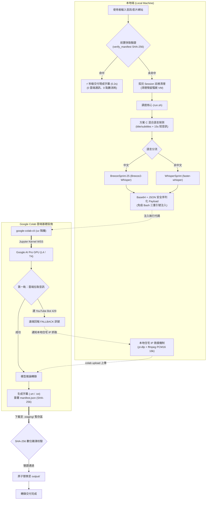

# Colab Dual ASR 智慧語音轉錄雙引擎分流排程系統

> **工業級、無人值守、智慧雙引擎分流之雲端語音轉錄管線**  
> 透過本地 CLI 驅動，直連 Google Colab 原生 Control Plane API + Jupyter Kernel WSS 通道，租賃 Google AI Pro GPU（L4 / T4）完成高通量推論，並具備自適應住宅 IP 救援與原子化產物同步機制。

[](prd.html)
[](https://github.com/lushinshang/newwhisper)
[](tests/)
[](his.html)
[](his.html)
[](LICENSE)

---

## 📑 目錄
- [🌟 核心特色](#-核心特色)
- [📐 系統架構圖](#-系統架構圖)
- [🚀 快速開始](#-快速開始)
- [💻 常用指令範例](#-常用指令範例)
- [📦 輸出檔案與 Manifest 規範](#-輸出檔案與-manifest-規範)
- [🧪 自動化測試與品質保證](#-自動化測試與品質保證)
- [🛡️ 工業級防禦性設計](#️-工業級防禦性設計)
- [🔒 資安稽核與隱私保護](#-資安稽核與隱私保護)
- [🙏 致謝與引用 (Acknowledgments)](#-致謝與引用-acknowledgments)
- [📚 專案文檔導覽](#-專案文檔導覽)

---

## 🌟 核心特色

1. **雙模型智慧分流（繁中精準 vs 國際多語）**：
   - **BreezeSprint-25（台灣繁中最佳化）**：引用自 [thc1006/breezesprint-25](https://github.com/thc1006/breezesprint-25)，採用中研院聯發科開源之 Breeze2-Whisper 語音模型，針對台灣語境、口音、專有名詞與標點符號進行特化重構。
   - **WhisperSprint（國際多語通用）**：引用自 [thc1006/whispersprint](https://github.com/thc1006/whispersprint)，基於 `faster-whisper` (CTranslate2) large-v3 模型，具備國際多國語言超高通量批量轉錄能力。
   - **方案 C 混合語言探測**：優先讀取影片中繼資料（標題與字幕標籤），必要時截取前 15 秒短音訊特徵分析，5 秒內無人介入自動智慧調度。
2. **Google Colab 原生直連（零第三方跳板）**：
   - 捨棄傳統 WebUI、Cloudflare Tunnel 或 ngrok 跳板，直接利用 `google-colab-cli` 原生對接 Control Plane API 與 Jupyter Kernel WebSocket (WSS)。
3. **自適應住宅 IP 雙軌救援（突破 YouTube 429 Bot 封鎖）**：
   - 第一軌（雲端高頻寬優先）：由遠端 VM 直接拉取音訊，耗時少、零本地頻寬負擔。
   - 第二軌（住宅 IP 救援）：若遠端遭遇 YouTube 機房 IP 阻擋（`Sign in to confirm you're not a bot`），遠端自動回報，本機自動以家用住宅 IP 抓取、轉為 16kHz PCM16 Mono 音訊並直傳 VM 接續推論，全流程無感自癒。
4. **前置產物快取（0 雲端延遲秒級交付）**：
   - 在進行任何網路連線與雲端巡檢前，優先檢驗本地成果是否存在且通過 `verify_manifest` SHA-256 雜湊驗證。二次執行僅需 **0.2 秒** 秒級交付，0 算力點數浪費。
5. **嚴格點數止血守護（0 殭屍 VM 殘留）**：
   - 具備 POSIX 信號攔截（SIGINT 130、SIGTERM 143、EXIT），異常或中斷必定觸發 `colab stop`。啟動前自動巡檢清理歷史殘留孤兒會話。
6. **原子化同步與安全防護（雙專家 Review 淬煉）**：
   - 歷經 **OpenAI Codex (GPT-6 Astra)** 與 **Anthropic Claude Code (Opus)** 雙頂級 AI 審查。
   - 採用 **Base64 + JSON 安全序列化傳參**，徹底消滅 Bash 注入風險。
   - 實作 **200 UTF-8 Bytes 安全檔名截斷** 與合法省略號 `...` 保留，防止 Linux ext4 崩潰。
   - 採用 **Staging 暫存下載與原子替換 (Atomic Sync)**，杜絕傳輸中斷污染既有良品。

---

## 📐 系統架構圖

本系統採用直屏友好的由上而下（`flowchart TD`）架構設計，在手機直屏與寬螢幕皆可順暢閱讀：



---

## 🚀 快速開始

### 1. 環境前置需求
- **作業系統**：macOS 或 Linux
- **工具鏈**：
  - [uv](https://docs.astral.sh/uv/)（極速 Python 套件管理器）
  - [ffmpeg](https://ffmpeg.org/)（音訊切片與轉檔）
  - [gcloud CLI](https://cloud.google.com/sdk/docs/install)（已登入 Application Default Credentials）

```bash
# 1. 確保 gcloud 具有 Colab 權限
gcloud auth application-default login --scopes="https://www.googleapis.com/auth/colaboratory,https://www.googleapis.com/auth/cloud-platform"

# 2. 複製專案並安裝依賴 (使用 uv 自動管理虛擬環境)
uv sync
```

---

## 💻 常用指令範例

### 基本用法（自動探測語言並分流調度）
```bash
# 轉錄 YouTube 影片 (自動依標題/內容分流至 Breeze2 或 Whisper)
./run.sh "https://www.youtube.com/watch?v=hy8UstR2NEg"

# 轉錄 Google Drive 分享連結 (49 分鐘繁中演講實測通過)
./run.sh "https://drive.google.com/file/d/1YourFileIdHere/view"

# 轉錄 HTTP(S) 音訊直連網址
./run.sh "https://example.com/audio/sample.mp3"
```

### 指定參數用法
```bash
# 強制指定以繁中 Breeze2 引擎轉錄
./run.sh "https://example.com/audio.mp3" --lang zh

# 強制指定以英文 Whisper 引擎轉錄
./run.sh "https://example.com/audio.mp3" --lang en

# 偏好指定租賃 T4 GPU (預設為優先租賃 L4)
./run.sh "https://example.com/audio.mp3" --gpu T4
```

---

## 📦 輸出檔案與 Manifest 規範

轉錄產物將自動儲存於專案根目錄的 `output/` 資料夾下，檔名已進行安全正規化與 UTF-8 200 Bytes 長度截斷：

```
output/
├── sample_chinese_lecture_49min.srt        # SRT 字幕檔 (含精準時間軸)
├── sample_chinese_lecture_49min.txt        # 純文字轉錄稿 (段落重構)
└── sample_chinese_lecture_49min.manifest.json  # 數位簽章與 SHA-256 雜湊驗證檔
```

### Manifest 結構範例
```json
{
  "source_url": "https://drive.google.com/file/d/...",
  "base_name": "sample_chinese_lecture_49min",
  "generated_at": 1727457000,
  "files": {
    "sample_chinese_lecture_49min.srt": {
      "sha256": "4a7b9e...",
      "size": 128450
    },
    "sample_chinese_lecture_49min.txt": {
      "sha256": "8f3c2a...",
      "size": 65120
    }
  }
}
```

---

## 🧪 自動化測試與品質保證

本專案配置完整的 Pytest 自動化測試套件，涵蓋快取驗證、語言探測、下載與備援、參數傳遞與腳本信號控制：

```bash
# 執行全量測試 (27 項測試規格)
uv run pytest
```

### 測試覆蓋範疇
- `tests/test_cache.py`：產物快取命中判定、Manifest SHA-256 驗證、壞檔排除與安全檔名處理。
- `tests/test_detect.py`：中繼資料解析、語言分類邏輯、15 秒切片決策分支。
- `tests/test_download.py`：安全檔名長度截斷（200 Bytes）、白名單省略號保留、Path Traversal 防禦。
- `tests/test_sync_artifacts.py`：Staging 暫存下載、原子替換（Atomic Move）、雜湊不符防護。
- `tests/test_transcribe_driver.py`：Base64 + JSON 安全序列化傳參結構檢驗。
- `tests/test_run_sh.py`：POSIX 信號捕捉（SIGINT / SIGTERM / EXIT）、孤兒清理邏輯。

---

## 🛡️ 工業級防禦性設計

| 潛在威脅與隱患 | 根本原因 | 本系統工程防禦措施 |
| :--- | :--- | :--- |
| **Bash 代碼注入** | Python 以三重引號字串直接拼接 URL 參數 | 改用 **Base64 + JSON 安全序列化** 傳參，代碼與資料完全隔離。 |
| **壞檔假命中** | 快取只看檔名與檔案是否存在 | 強制調用 `verify_manifest` 逐檔比對 **SHA-256 數位雜湊**。 |
| **Linux 檔名崩潰** | 影片長標題超過 ext4 255 位元組上限 | 實裝 **200 UTF-8 Bytes 安全長度截斷**，預留副檔名空間。 |
| **下載中斷毀損** | 遠端直接下載覆蓋本地檔案 | 實裝 **Staging 暫存隔離與原子替換**，驗證失敗絕不替換良品。 |
| **雲端點數偷跑** | 使用者按下 Ctrl+C 或網路中斷 | POSIX `trap` 精確攔截信號，退出時強制觸發 `colab stop`。 |
| **YouTube 429 阻擋** | Colab 資料中心 IP 被 YouTube 風控 | 自動啟用 **住宅 IP 救援機制**，本地無感抓取直傳續推。 |

---

## 🔒 資安稽核與隱私保護 (Security & Privacy Audit)

本專案在正式開源發布至 GitHub 之前，全面導入紅藍隊視角，由 **OpenAI Codex** 與 **Claude Code（搭配 `security-review` 資安技能）** 進行雙重動態與靜態滲透稽核，達到 **100% 零機密外洩標準**：

| 稽核項目 (Audit Items) | 檢查手段與規則 | 實測防護結論 |
| :--- | :--- | :--- |
| **個人識別資訊 (PII)** | 全局掃描電子郵件、電話號碼、個人帳號與身份標識 | ✅ **安全無外露**。僅包含正規開源套件版本號與 CDN 靜態資源。 |
| **API Keys 與憑證** | 檢測 `AIza`、`sk-`、`ghp_`、`AKIA`、PEM 私鑰等機密特徵 | ✅ **安全無外露**。無任何硬編碼金鑰，敏感配置完全依賴本地環境變數。 |
| **開發者路徑脫敏** | 全文檢索 `/Users/`、`/home/`、`C:\Users` 等絕對路徑 | ✅ **安全無外露**。全數改用 `os.path.expanduser` 動態解析與相對路徑。 |
| **雲端連結與測試資料** | 檢驗 Google Drive ID、YouTube 私人連結與真實檔名 | ✅ **安全無外露**。所有測試連結與檔案皆已 Mock 去識別化與佔位符處理。 |
| **Git 歷史完整性** | `git log --all --diff-filter=A` 審查所有曾提交檔名 | ✅ **乾淨無殘留**。單一純淨 Commit 交付，無歷史覆寫前殘留機密。 |
| **邊界防護 (.gitignore)** | 覆蓋 `.env*`、憑證、Token、私鑰與暫存快取 | ✅ **防護完備**。杜絕本機快取與私人 Cookie 不慎上傳風險。 |

---

## 🙏 致謝與引用 (Acknowledgments)

本專案的核心轉錄引擎深度整合並引用了開源社群 **[thc1006](https://github.com/thc1006)** 所精心開發維護的兩大優秀專案：

- 🇹🇼 **[breezesprint-25](https://github.com/thc1006/breezesprint-25)**：專為台灣繁體中文語境、術語與標點符號最佳化的 Breeze2-Whisper 極速轉錄專案。
- 🌐 **[whispersprint](https://github.com/thc1006/whispersprint)**：基於 faster-whisper CTranslate2 高通量架構的國際多語言通用轉錄專案。

由衷感謝原作者 **thc1006** 的卓越貢獻與開源精神，為本系統的雙引擎分流排程與雲端原生直連架構提供了穩定強大的推論基石！

---

## 📚 專案文檔導覽

- **[產品需求規格書 (PRD.html)](prd.html)**：包含專案經理 (PM)、系統分析師 (SA)、主任架構師 (Tech Lead) 視角的完整三權分立規劃、容錯狀態機與 FMEA 失效分析。
- **[專案演進歷程 (his.html)](his.html)**：詳細記錄從雙模型探索、YouTube 攻防突破、長音訊全量驗收，到 Codex 與 Claude Opus 雙專家 Review 的真實工程歷程。
